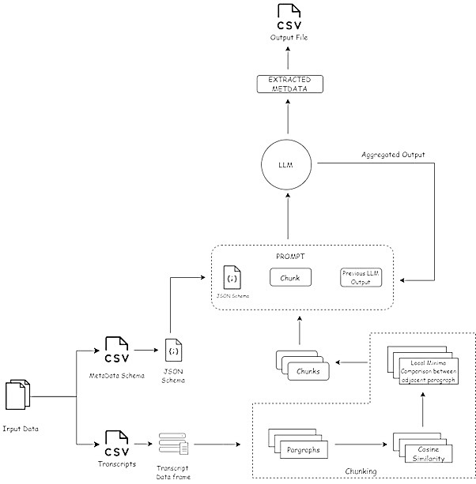

# A Large Language Model approach to extract Biographical Transcripts 

## **Why This Project?**
The **German Memory archive** contains a vast collection of **subjective memories, interviews, diaries, and letters**.
 Traditional metadata extraction is time-consuming and labor-intensive. Our AI-powered approach streamlines the process by:
- **Reducing manual effort** for archivists and researchers.
- **Improving data accessibility** through structured metadata representation.
- **Ensuring accuracy and consistency** in metadata extraction.

---

## **Data Overview**  
The project utilizes interview transcripts stored in tab-separated values (TSV) files, each containing 12 columns such as spoken text, timestamps, speaker information, translations, and annotations. Post-processing, the extracted metadata is organized into a structured format with 136 columns categorized into 13 major groups, ensuring comprehensive information retrieval.

---

## **How It Works**
### **1. Data Preprocessing**
- Cleans interview transcripts stored in **TSV format**.
- Standardizes formatting while preserving **timestamps, speaker details, and text content**.

### **2. Context-Aware Text Segmentation**
- **Challenge**: Interviews are lengthy and unstructured, making traditional chunking unreliable.
- **Solution**: A **cosine similarity-based segmentation approach** ensures **logical breakpoints** while preserving topic coherence.

### **3. AI-Powered Metadata Extraction**
- Utilizes **Llama-3.3 70B**, a powerful multilingual **LLM**, for metadata extraction.
- Extracts key **biographical details** such as **names, birth years, locations, occupations, and interview themes**.

### **4. Structured Metadata Output**
- The extracted metadata is formatted into **CSV/JSON**, making it easy to store, analyze, and integrate into archival systems.

---

## **System Architecture**  


## **Architecture Overview**
Below is a high-level view of the **system workflow**:

**Preprocessing** → Cleans raw transcripts.  
**Chunking Strategy** → Segments interviews into **contextual chunks**.  
**Metadata Extraction** → Uses **LLM-driven AI** to extract structured information.  
**Post-Processing** → Outputs data in **CSV/JSON** format for easy access.

---

## **Challenges & Future Improvements**

- **Handling Large Transcripts Without Losing Context**: Chunking strategies can miss complex relationships or references across distant segments, especially when interviewees refer back to earlier points.

- **Variability in LLM Responses**: Different LLMs provided varying results, especially Mixtral 8x7B across platforms. This highlights the need for consistency in LLM outputs.

### **Future Enhancements**
- **Incorporation of Human Annotation for Quality Control**: Introducing human validation to evaluate the model’s precision will refine prompts and processing logic.

- **Multi-model ensemble approach** to enhance reliability.

---

## **How to Use the Repository**
1. **Clone the Repository**:
   ```bash
   git clone https://github.com/Dharshan110701/case_study.git
   cd case_study
   ```

2. **Install Dependencies**:
   ```bash
   pip install -r requirements.txt
   ```

3. **Run the Metadata Extraction Pipeline**:
   ```bash
   python main.py
   ```
   *(Note: The repository also contains an API file using Groq for testing, but it is not required for the main execution pipeline.)*

---

## **Contributors**
- **Dharshan Dhanashekar** (SRH Hochschule Heidelberg)  
- **Harshita Jamadade** (SRH Hochschule Heidelberg)  
- **Navneeth Krishna Aravind** (SRH Hochschule Heidelberg)  

---
